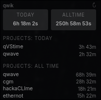

<h1 align="center">qVStime!</h1>

    

</img>

> A dead simple VSCode / VSCodium extension to display your Hackatime stats!

## Installation
Simply download the .vsix file from the Releases tab, then press `CTRL + SHIFT + P` in VSCode and navigate to `Extensions: Install from VSIX`. Reload your extensions, and it should be good to go on the sidebar! Your API key is detected automatically from `~/.wakatime.cfg`.

## Usage
...i mean you've already read this much, surely the extension shouldn't pose a challenge

<i>this is a low effort project, sorrie, this will probably never be updated</i>